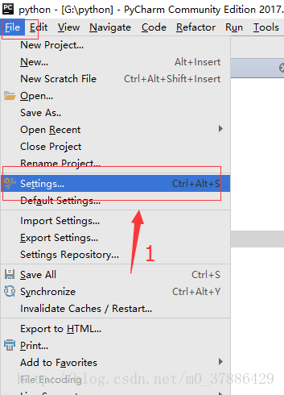
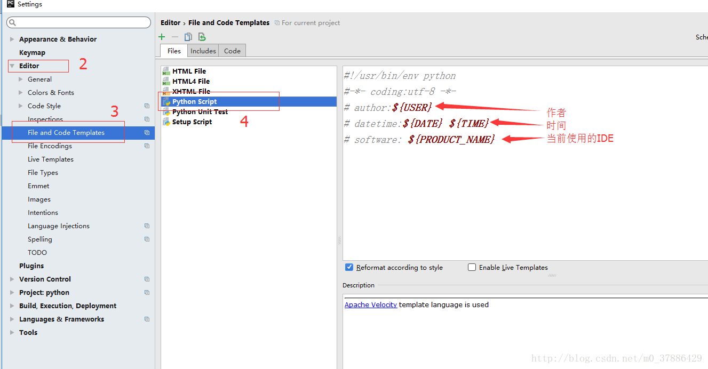
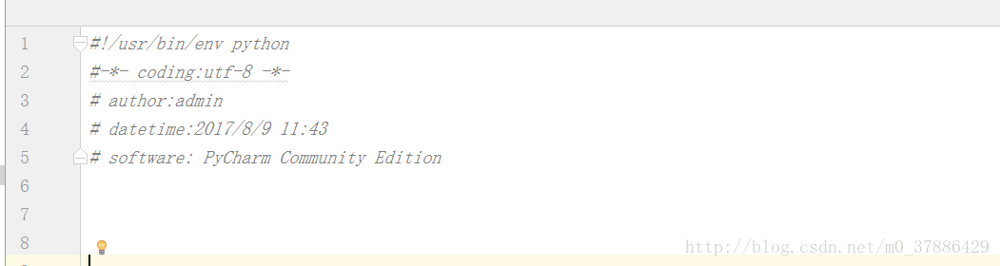

# Pycharm代码模板（默认添加个人信息：时间，作者，邮箱等）

**方法如下：**

1.打开pycharm，选择File-Settings



2.Editor –> File and Code Templates –> Python Script 



3.填写个人信息 

```python
!/usr/bin/env python

-- coding:utf-8 --

author:${USER}

datetime:{DATE} {TIME}

software: ${PRODUCT_NAME}
```

**备注：可用的预定义文件模板变量为** 

```python
${PROJECT_NAME} - 当前项目的名称。
${NAME} - 在文件创建过程中在“新建文件”对话框中指定的新文件的名称。
${USER} - 当前用户的登录名。
${DATE} - 当前的系统日期。
${TIME} - 当前系统时间。
${YEAR} - 今年。
${MONTH} - 当月。
${DAY} - 当月的当天。
${HOUR} - 目前的小时。
${MINUTE} - 当前分钟。
${PRODUCT_NAME} - 将在其中创建文件的IDE的名称。
${MONTH_NAME_SHORT} - 月份名称的前3个字母。 示例：一月，二月等
${MONTH_NAME_FULL} - 一个月的全名。 示例：一月，二月等
```

4.创建python文件 



