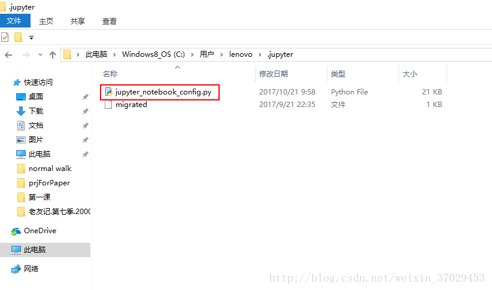

# 如何修改jupyter notebook的 默认目录和默认浏览器

# 一.修改默认目录

1 、找到一个用于存放config文件的文件夹，用cmd来查找路径：

```
在cmd中 输入命令 jupyter notebook --generate-config（前面是两个-后面是一个-）
```


2、按照第1步找到的路径寻找文件名是“jupyter_notebook_config.py”的一个文件 



3、用notebook打开该文件，修改

“# The directory to use for notebooks and kernels.”下面的

“# c.NotebookApp.notebook_dir = ''”​为

“c.NotebookApp.notebook_dir = '指定的工作路径'”​（注意将#号删除）

（需要修改的语句在179行！）


然后重启一下jupyter nootbook，默认路径确实更改了。完工！ 

# 二. 修改默认浏览器


## 在73行之后加上

 import webbrowser

 webbrowser.register("chrome", None, webbrowser.GenericBrowser(u"C:\\Program Files (x86)\\Google\\Chrome\\Application\\chrome.exe"))

c.NotebookApp.browser = 'chrome'


